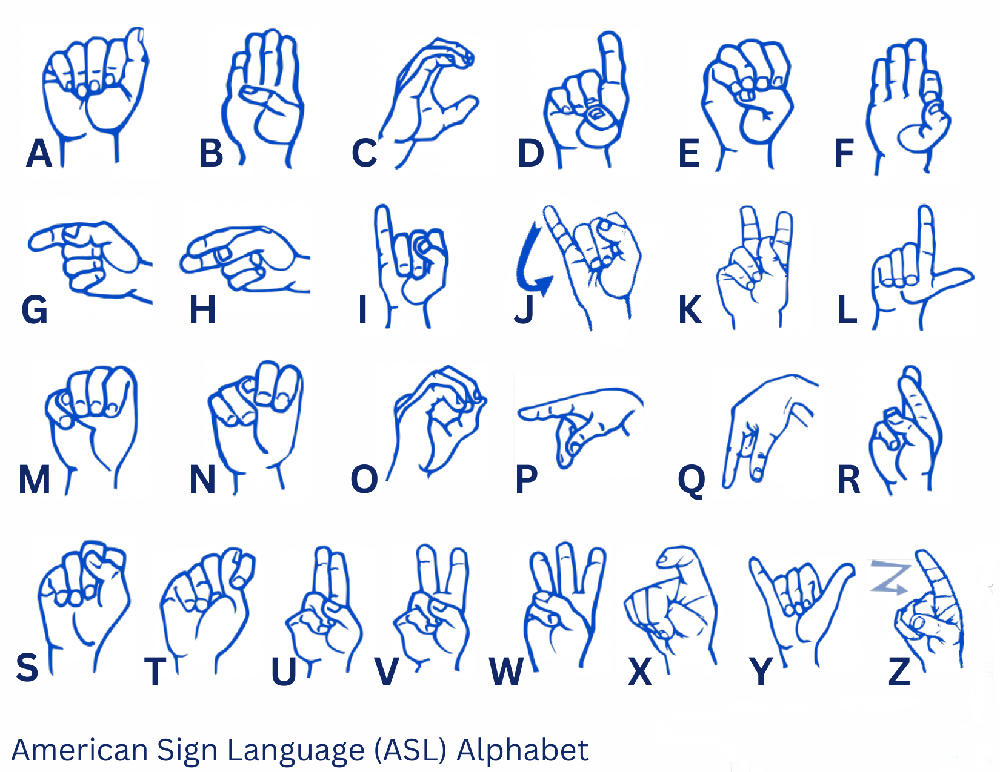

# ASL Sign Language Recognition

This project aims to build a machine learning model that recognizes American Sign Language (ASL) hand signs using Convolutional Neural Networks (CNN). The model is trained using images captured from a webcam and uses TensorFlow for building the CNN model. It also utilizes data augmentation techniques to improve the model's robustness and generalization.



## Project Structure

The project captures images and performs the following tasks:

1. **Capture ASL Sign Images**: Captures images for each letter of the ASL alphabet.
2. **Data Preprocessing**: Preprocesses images to normalize and resize them to a consistent format.
3. **Model Training**: Uses TensorFlow to build and train a CNN model for recognizing ASL signs.
4. **Data Augmentation**: Applies various augmentation techniques (rotation, zoom, flipping) to increase the diversity of the dataset.
5. **Audio-to-Text**: Captures speech through a microphone and converts it into text using speech recognition (optional feature).


## Requirements

- Python 3.x
- OpenCV (`cv2`)
- TensorFlow
- Mediapipe
- SpeechRecognition
- NumPy
- scikit-learn

### Install Dependencies

To install the required libraries, run the following command:

```bash
pip install opencv-python mediapipe tensorflow SpeechRecognition numpy scikit-learn
```
## Steps

1. **Capture ASL Sign Images**
   The `capture_images()` function captures images for each letter of the ASL alphabet. It uses the webcam to detect hand signs and saves the images in a folder.

   The images are saved in a directory structure like:

``` bash 
dataset/ A/ 0.jpg1.jpg... B/ 0.jpg1.jpg... ...
 ```


2. **Preprocess Images**
The `preprocess_images()` function performs the following:

- Resizes each captured image to a fixed size (e.g., 64x64 pixels).
- Normalizes the images by dividing pixel values by 255 (scales them between 0 and 1).
- Converts labels (letters of the alphabet) to a numerical format.

3. **Model Training**
The `train_model()` function defines and trains a CNN model using the processed images. The model architecture includes:

- Two convolutional layers with ReLU activations.
- Max-pooling layers.
- Fully connected layers.
- Output layer with 26 units (one for each letter in the ASL alphabet).

The model is compiled using the Adam optimizer and categorical cross-entropy loss.

4. **Data Augmentation**
To enhance model performance and prevent overfitting, the project includes data augmentation using TensorFlow's ImageDataGenerator. The augmentations include:

- Rotation: Randomly rotates images between -30 and 30 degrees.
- Width and height shifts: Randomly shifts images horizontally and vertically.
- Zoom: Random zoom of images.
- Flip: Random horizontal flipping.
- Shear: Random shearing transformations.

5. **Save and Evaluate the Model**
Once the model is trained, it is saved to a `.h5` file using `model.save()`. You can then use the saved model to make predictions on new images.

6. **Audio-to-Text (Optional)**
The `capture_audio_to_text()` function listens to the microphone and converts speech into text using the SpeechRecognition library. The recognized text is saved in a `.txt` file.


## Example
``` python
# Step 1: Capture ASL sign images
capture_images()

# Step 2: Preprocess the captured images
images, labels = preprocess_images()

# Step 3: Train the model with the preprocessed images (including augmentation)
model, label_encoder = train_model(images, labels, epochs=30)

# Step 4: Optionally, save the trained model
model.save("asl_sign_language_model.h5")
print("Model trained and saved.")

# Step 5: Capture audio and convert it to text
capture_audio_to_text()
```

## Model Architecture

The CNN model used for ASL sign recognition consists of the following layers:

- **Conv2D Layer**: Applies 32 filters of size 3x3 with ReLU activation.
- **MaxPooling2D Layer**: Reduces the dimensionality of the feature maps.
- **Conv2D Layer**: Applies 64 filters of size 3x3 with ReLU activation.
- **MaxPooling2D Layer**: Reduces dimensionality again.
- **Flatten Layer**: Flattens the feature maps into a 1D vector.
- **Dense Layer**: A fully connected layer with 128 neurons and ReLU activation.
- **Dense Output Layer**: A fully connected layer with 26 neurons (one for each ASL letter) and softmax activation for multi-class classification.

## Model Compilation

The model is compiled with:

- **Optimizer**: Adam optimizer
- **Loss Function**: Categorical cross-entropy (since this is a multi-class classification task)
- **Metrics**: Accuracy

## Evaluation

After training, the model can be evaluated using new data to check the accuracy. The model’s performance depends on the amount and variety of data, as well as the effectiveness of the data augmentation techniques.
